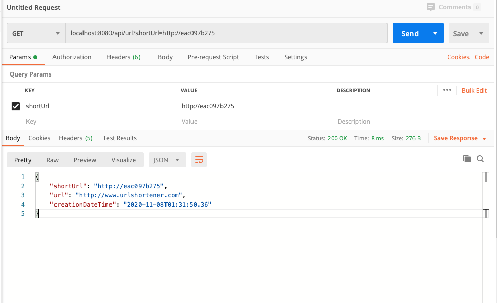
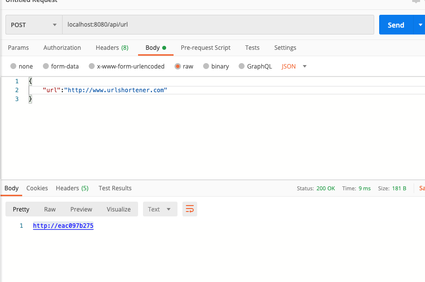

# UrlShortener with redis
Not the best solution when generate short url this create 2 entry in redis one for original url with a key 
and the other one for the short url with a key.

## Requirements
* Java 8
* Apache Maven 3.5.0 or higher
* Docker install
* Redis (use it has a persistence so the TTL is not set)

## How to Run first solution

- Clone the project
- Configure Redis password in application.properties there is default password if using docker
- installing redis in your local machine
- Build the project  
- Remove anything from application.properties if using your own local redis
```
mvn clean install
```
- Run the application
```
java -jar target/urlshortener-service-0.0.1-SNAPSHOT.jar
```
- Make sure your redis-server is up and running

## Using docker Second solution recommend more easy

- Build the project  
```
mvn clean install
```
- Run using docker-compose
```
docker-compose up --build 
```

## HOW to test

- you need postman install 
- or you can use swagger http://localhost:8080/swagger-ui/index.html and make request base on postman example

GET




POST


